# TryHackMe: Network Services (Room 1)

**Platform:** TryHackMe
**Difficulty:** Easy
**Target:** Single Linux lab machine, three services in scope: SMB, Telnet, FTP

## Overview

This room covers enumeration and exploitation of three classic, commonly
misconfigured network services. Rather than relying on a software
vulnerability, each service here is beaten through poor configuration —
anonymous access, a hidden "backdoor" service, and a weak credential. That
makes it a good room for building enumeration discipline: in each case, the
win comes from reading the output carefully, not from running an exploit.

## Environment setup

Partway through this room I ran out of AttackBox free-tier time and
pivoted to my local Windows machine over the TryHackMe OpenVPN client.
That brought its own setup work before I could even get back to the
target:

- **Tooling:** Installed `nmap` on Windows via `winget install --id=Insecure.Nmap -e`. Had to restart the terminal session afterward — an open shell doesn't pick up a PATH change made by an installer run in a different window.
- **Npcap driver issue:** Nmap initially failed with `Error compiling our pcap filter: expression rejects all packets`, caused by an outdated driver on the OpenVPN virtual adapter. Fixed properly by updating Npcap and running the terminal as Administrator. Before that fix, `-Pn --unprivileged` worked as a workaround by forcing Nmap onto standard user-mode sockets instead of raw packet capture.
- **Hydra on Windows:** Windows Defender flagged a locally-built Hydra as a Trojan/HackTool, which is expected behavior for a password-cracking tool, not a sign anything was wrong. Used a pre-compiled Windows Hydra build instead and added a Defender folder exclusion for a dedicated `C:\Tools` directory so the binary wouldn't get quarantined mid-attack.
- **Linux-path assumptions:** Commands copied from Linux-oriented guides reference paths like `/usr/share/wordlists/rockyou.txt`, which don't exist on Windows. Pulled a copy of `rockyou.txt` into the local tools directory and adjusted syntax to use relative paths instead.

Worth noting for anyone repeating this on Windows: a lot of the friction
here had nothing to do with the target machine and everything to do with
running offensive Linux tooling on a Windows host. That's a fair
reflection of real-world work too — your attack environment is rarely
pre-built for you.

## Methodology

### SMB

Started with an nmap version scan, which found SSH plus two SMB ports:

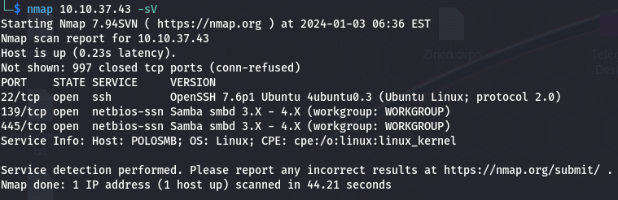
*Figure 1: Initial nmap scan — SSH (22) plus SMB on 139 and 445, running Samba 3.X–4.X.*

Ran `enum4linux` for full basic enumeration. It returned the workgroup
name and, separately, OS details including the machine's hostname:

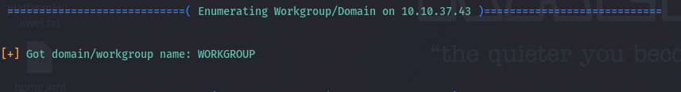
*Figure 2: enum4linux confirming the domain/workgroup name.*

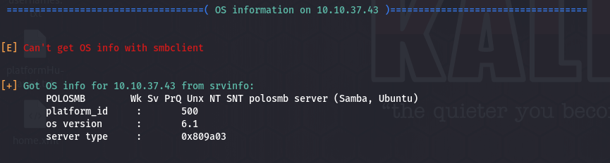
*Figure 3: enum4linux OS info — hostname `POLOSMB`, OS version 6.1, Samba on Ubuntu.*

Share enumeration turned up four shares, one of which — `profiles` — stood
out as worth investigating, since the others are standard default shares:

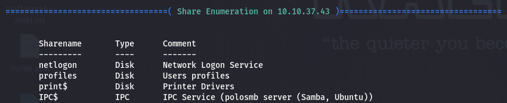
*Figure 4: Available SMB shares — `profiles` is the non-default one worth a closer look.*

Connected to `profiles` with `smbclient`, authenticating as `Anonymous`
with no password — the share allowed the connection without credentials:

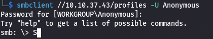
*Figure 5: Anonymous SMB login succeeding against the `profiles` share.*

Inside, a text file addressed to a specific user explained they'd been
given SSH access to work from home — handing over both a username and the
service to target:

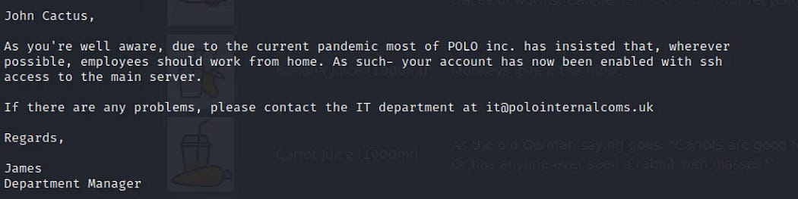
*Figure 6: Internal memo found on the share, naming the user and confirming SSH access was granted.*

Listing the user's home directory showed a `.ssh` folder, and inside it,
a private key:

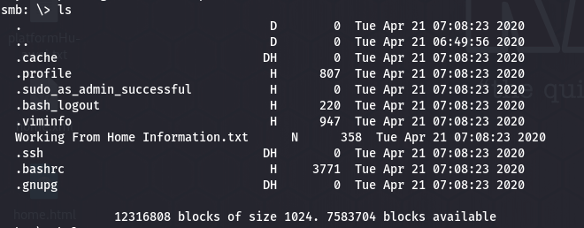
*Figure 7: The user's share contents, including the `.ssh` directory.*

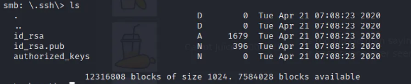
*Figure 8: Inside `.ssh` — a private key (`id_rsa`) available for download.*

Downloaded the key, set its permissions to `600` (SSH refuses to use a
key with overly-open permissions), and used it with the username from
the memo to authenticate over SSH:

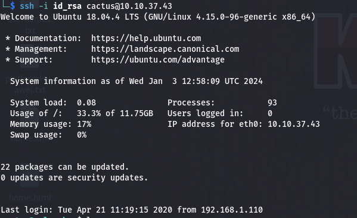
*Figure 9: SSH access confirmed using the recovered key and username.*

### Telnet

A full port-range scan (`-p-`) found exactly one open port, on an unusual
high port rather than the standard Telnet port 23:

*Figure 10: A full-range scan was required to find this — the service sits well outside Nmap's default port range.*

Re-running the scan without `-p-` (the default top-1000-ports scan) found
nothing at all on this host — confirming a default scan would have missed
this machine's only open service completely:

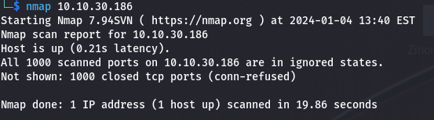
*Figure 11: Same host, default port range — zero results. The lesson of this section in one screenshot.*

Connecting directly to the port returned a banner identifying itself as a
"backdoor":

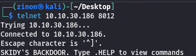
*Figure 12: Telnet banner naming itself a backdoor on connection.*

Typing commands produced no visible output, so I set up a local `tcpdump`
listener for ICMP traffic and sent a ping through the session to confirm
whether commands were actually executing:

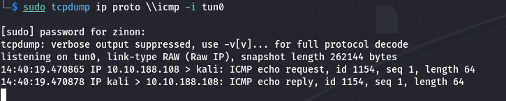
*Figure 13: ICMP traffic confirms the session really was executing system commands — it just wasn't echoing output.*

Generated a reverse shell payload with `msfvenom` (a Netcat-based Unix
payload) targeting my own IP and a chosen listening port:

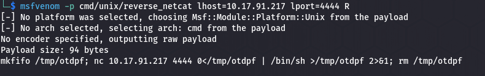
*Figure 14: Reverse shell payload generated with msfvenom.*

Started a Netcat listener locally, then executed the payload through the
Telnet session:

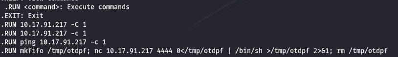
*Figure 15: Executing the generated payload through the Telnet session's command interface.*

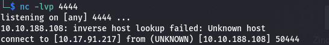
*Figure 16: Shell caught — the Netcat listener receives the callback from the target.*

### FTP

An initial nmap scan found two open ports, including FTP; a follow-up
version scan identified the specific FTP server software in use:

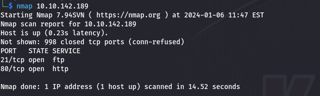
*Figure 17: Initial scan — FTP (21) and HTTP (80) open.*

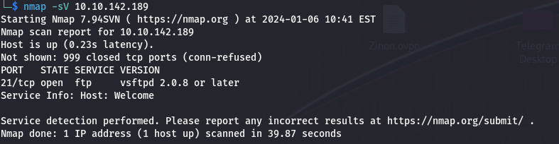
*Figure 18: Version scan confirms the FTP variant — vsftpd 2.0.8+.*

Logged in with username `anonymous` and no password, per FTP's common
(and insecure) anonymous-login convention. A single file sat in the
anonymous directory:

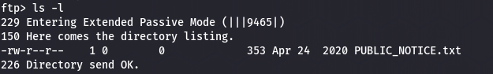
*Figure 19: Anonymous FTP access — one file available in the directory.*

That file turned out to be a notice from a staff member, which handed
over a likely username for the next stage:

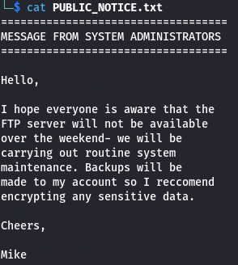
*Figure 20: The notice's contents — signed by a user whose name became the brute-force target.*

Used Hydra to brute-force that user's FTP password against the
`rockyou.txt` wordlist, which succeeded within the password list:

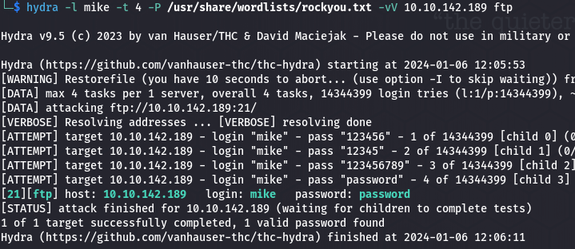
*Figure 21: Hydra finds a valid password for the account within the wordlist.*

Logged in via FTP with the cracked credential and retrieved the target
file to confirm the compromise:

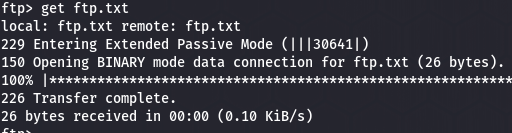
*Figure 22: Retrieving the target file over an authenticated FTP session.*

## Key findings

- **SMB:** Anonymous/unauthenticated access to a share exposed information that shouldn't be available without credentials — including, ultimately, a path to a private key.
- **Telnet:** A service was deliberately hidden on a non-standard port rather than secured, which only delays discovery rather than preventing it, and the service itself ran as an unauthenticated command interface.
- **FTP:** Anonymous login was enabled and a weak, dictionary-crackable password was in use on a real account, letting a brute-force attack succeed in reasonable time.

Across all three, the pattern is the same: the services weren't exploited
through a technical flaw in the software, but through configuration that
trusted the network more than it should have.

## Defensive takeaways

- **SMB:** Disable anonymous and guest access, enforce SMB signing, disable SMBv1, and restrict shares to least privilege. Enumeration tools like `enum4linux` only work because unauthenticated users are allowed to ask these questions in the first place.
- **Telnet:** Telnet transmits everything, including credentials, in cleartext, and "hiding" a service on a non-standard port is not a substitute for securing it. Replace it with SSH; if it must remain for legacy reasons, restrict it to a management VLAN and alert on connection attempts.
- **FTP:** Disable anonymous login unless there's a genuine business need for it. Use SFTP or FTPS instead of plain FTP, enforce strong passwords with lockout/rate-limiting to blunt brute-force attempts, and don't expose FTP directly to the internet.
- **Across all three:** Run only the services actually needed, patch and update regularly, segment the network so a compromised service doesn't expose everything else, and log authentication attempts so repeated failures (like a Hydra run) get flagged rather than going unnoticed.

## What I learned

The biggest lesson here came from getting my own attack environment
working on Windows instead of a pre-built Linux AttackBox. Tool
installation, driver issues, and even antivirus false-positives on
security tools are things a lot of writeups skip over, but they're a
realistic part of doing this work outside a sandboxed lab. On the target
side, the Telnet section was the most instructive: running a full
port-range scan instead of relying on defaults was the only reason that
service was found at all, which reinforced that thorough enumeration
matters more than clever exploitation.
