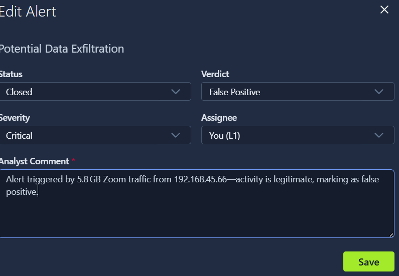
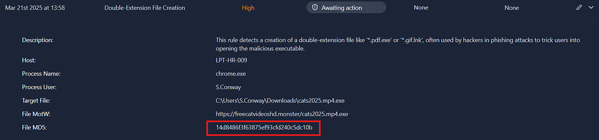
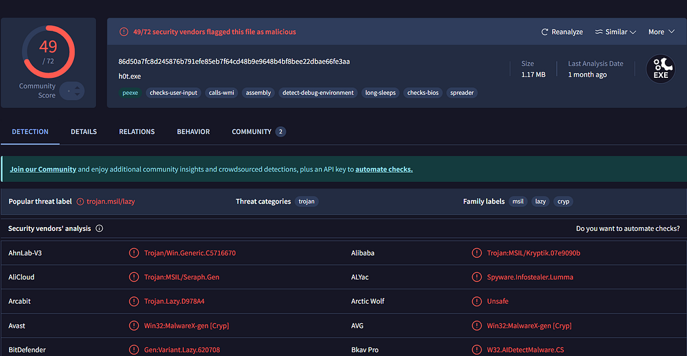
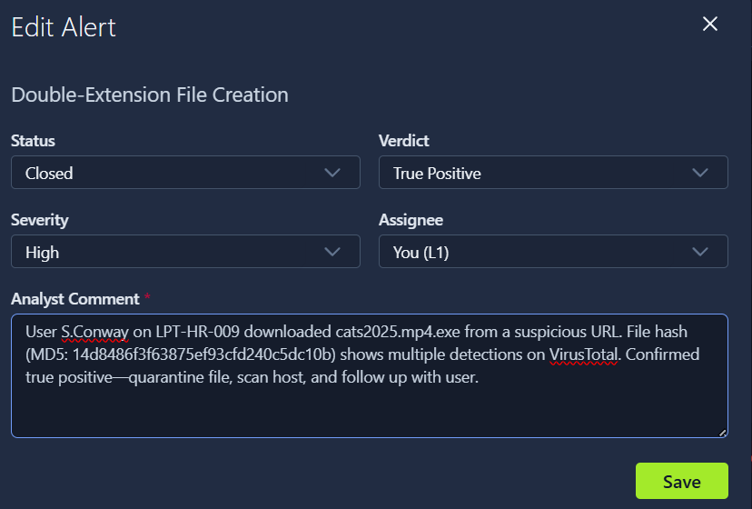
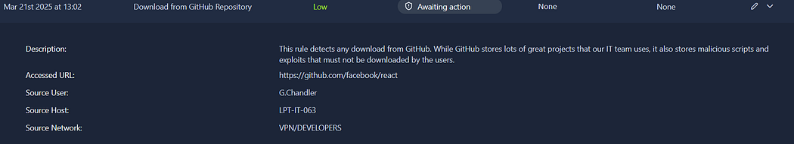
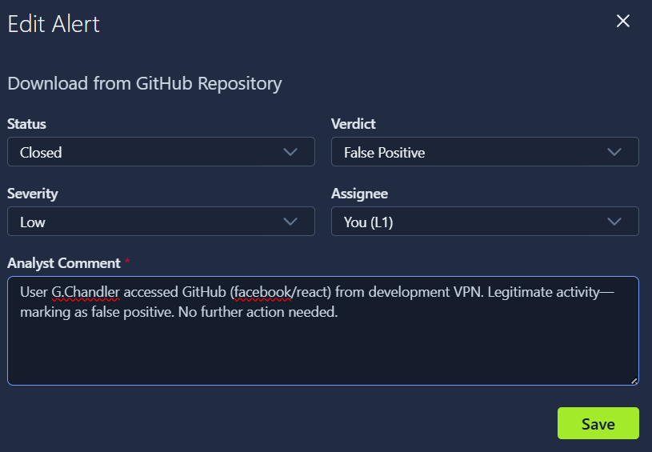

# TryHackMe: SOC L1 Alert Triage

**Platform:** TryHackMe
**Room:** SOC L1 Alert Triage (SOC Level 1 path)
**Date completed:** October 2026
**Tooling:** TryHackMe SIEM dashboard, VirusTotal

## Overview

This room simulates the day-one responsibility of a SOC L1 analyst: given a
queue of unresolved alerts, decide which to work first, investigate each
one using the context available in the SIEM, and reach a defensible
verdict — true positive or false positive — with a written justification.
Unlike a pentest-style room, the goal here isn't to "win" by exploiting
something, it's to make the right call and be able to explain why, which
is the actual day-to-day output of a SOC analyst role.

## Alert queue and prioritization

The dashboard showed five alerts total, three of them unresolved and
awaiting triage, two already closed as worked examples for review:

| Alert | Severity | Status |
|---|---|---|
| Potential Data Exfiltration | Critical | Awaiting action |
| Double-Extension File Creation | High | Awaiting action |
| Download from GitHub Repository | Low | Awaiting action |
| Unusual VPN Login Location | Medium | Closed (example) |
| Bruteforce Attack from External | Medium | Closed (example) |

Before investigating anything, the room's workflow calls for triaging the
queue itself: ignore alerts already being worked, then sort the rest by
severity (critical first), then by age within the same severity. Applying
that logic put **Potential Data Exfiltration** first, **Double-Extension
File Creation** second, and **Download from GitHub Repository** third —
which is the order I worked them in.

## Methodology and findings

### 1. Potential Data Exfiltration (Critical)

- **Alert context:** Flagged a large volume of outbound traffic — 5.8 GB — from an internal host (192.168.45.66).
- **Investigation:** Reviewed the traffic context in the alert details to determine what the data volume actually represented.
- **Verdict:** **False positive.** The traffic was legitimate Zoom (video conferencing) traffic, not exfiltration — a large data volume alone isn't suspicious once the application generating it is identified.

*Figure 1: Closing the Data Exfiltration alert as a false positive, with the Zoom traffic explanation logged as the analyst comment.*

### 2. Double-Extension File Creation (High)

- **Alert context:** Detected creation of a double-extension file (`cats2025.mp4.exe`) — a pattern commonly used in phishing to disguise an executable as a harmless media file. Host: `LPT-HR-009`. Process: `chrome.exe`. Process user: `S.Conway`. The file was downloaded to `C:\Users\S.Conway\Downloads\` from an external URL.

*Figure 2: Alert details — the double-extension file, download source, and the MD5 hash used for the VirusTotal lookup.*

- **Investigation:** Pulled the file's MD5 hash (`14d8486f3f63875ef93cfd240c5dc10b`) from the alert and checked it against **VirusTotal**. The result showed **49 of 72 security vendors** flagging the file as malicious, with a consistent trojan classification across multiple vendors (labelled variously as `Trojan.MSIL`/`Trojan.Win32`/`Spyware.Infostealer` family).

*Figure 3: VirusTotal result for the file hash — 49/72 vendors flagged it malicious, with a consistent trojan classification.*

- **Verdict:** **True positive.** The double-extension technique, the suspicious download source, and the VirusTotal detection rate together left no reasonable doubt.

*Figure 4: Closing the alert as a true positive, with the VirusTotal evidence and remediation steps logged.*

### 3. Download from GitHub Repository (Low)

- **Alert context:** Flagged a download from GitHub, a platform the IT team legitimately uses but one that can also be abused to deliver malicious scripts. Source user: `G.Chandler`. Source host: `LPT-IT-063`. Source network: the developer VPN. Repository accessed: `facebook/react`.

*Figure 5: Alert details — the accessed repository, source user, host, and network segment.*

- **Investigation:** Checked the repository and user context — a developer, on the developer VPN, pulling a widely-used, legitimate open-source project.
- **Verdict:** **False positive.** The combination of user role, network segment, and a well-known legitimate repository pointed clearly to routine developer activity rather than malicious tooling retrieval.

*Figure 6: Closing the alert as a false positive, with the developer-VPN context logged as justification.*

## Key findings

- Severity alone doesn't determine whether an alert is a real threat — the Critical-severity alert (Data Exfiltration) turned out to be benign, while the High-severity alert (Double-Extension File Creation) was confirmed malicious. Severity sets investigation priority, not the verdict.
- Context resolves ambiguity faster than raw detection logic. In each case, the deciding factor wasn't the alert itself but what it meant once cross-referenced with user role, host, network segment, or (for the malicious file) external threat intelligence.
- A single IOC — a file hash — checked against VirusTotal was enough to move the Double-Extension alert from "suspicious" to "confirmed," which is a fast, high-value first move for any file-based alert.

## Defensive takeaways

- **Large-volume alerts need application context, not just a size threshold.** A 5.8 GB transfer alert without visibility into which application generated it will always produce noise; tuning detections to account for known-legitimate high-bandwidth apps (video conferencing, backups) reduces false positives like this one.
- **Double-extension files are a cheap, high-signal detection.** This is a well-known phishing/malware delivery pattern, and alerting on it specifically (rather than relying on generic antivirus) catches a class of attack that slips past less-targeted detection.
- **Hash-based threat intel lookups should be a standard first step** for any alert involving a downloaded file — it's fast, free (for individual lookups), and often decisive.
- **Role and network-segment context should feed directly into alert logic.** A GitHub download from a developer on the developer VPN is categorically different from the same download from, say, an HR workstation — detection rules that don't account for this generate avoidable noise for L1 analysts.

## What I learned

The clearest lesson from this room was that triage is a judgment call built
on context, not a lookup table. The same action (a large transfer, a file
download) can be completely benign or a confirmed compromise depending on
who did it, from where, and what else is known about the file or traffic
involved. Pulling the suspicious file's hash and checking it against
VirusTotal was the single most useful habit I picked up here. It turned
a "this looks odd" alert into a defensible, evidence-backed verdict in
under a minute, which is exactly the kind of fast, confident decision-making
a SOC L1 role actually requires.
